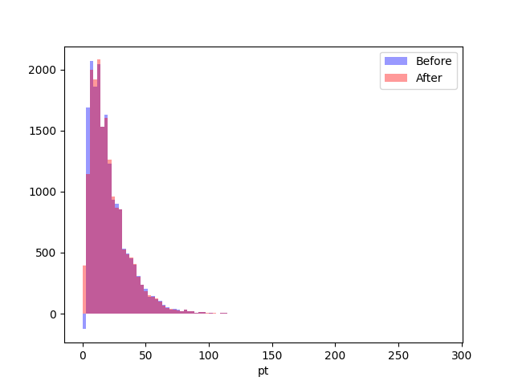
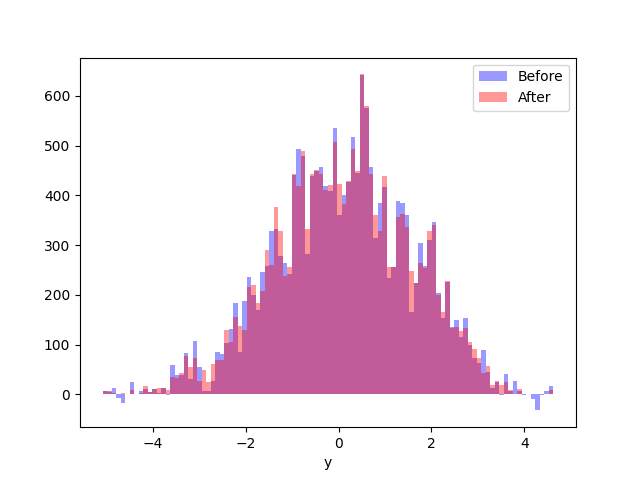

## GSoC Pre-Selection Task: Negative Weight Mitigation with Cell Resampling 

### Results
 

Fig. 1: Histogram for $\rho_T$

 

Fig. 2: Histogram for $y$

### Structure and Computational Complexity
This is my implementation of the Cell Resampling Method. Overall structure of the code is as follows, with more comments in the script:

1. Read both datasets into dataframes.
2. Apply the Born Transform to all $\rho_T$ and $y$ values in the virtual_events dataset with the formula:
   - $\rho_T = \rho_{T, real} + z_{gluon}$ 
   - $y = y_{real}$
3. Merge both the (modified) virtual and real events into one.
4. Looping through each negative weight event and calculating its distance to all other events, building its cell, and using cell resampling to adjust all weights within that cell.
5. Using the original and new (all positive) weights to generate the two required histograms

